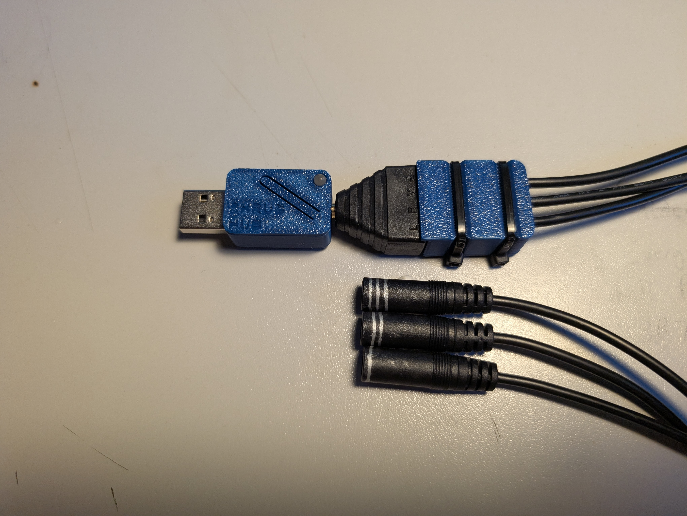
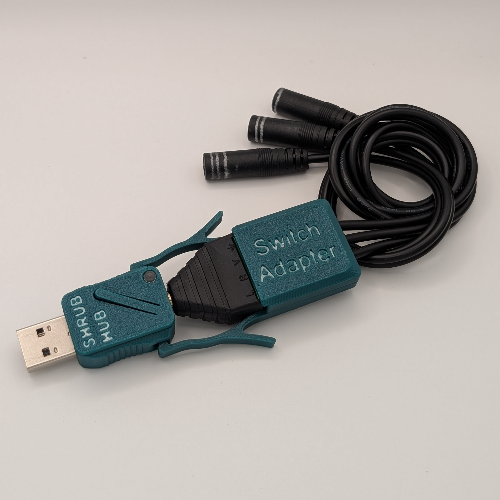
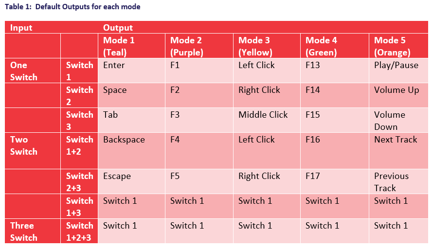
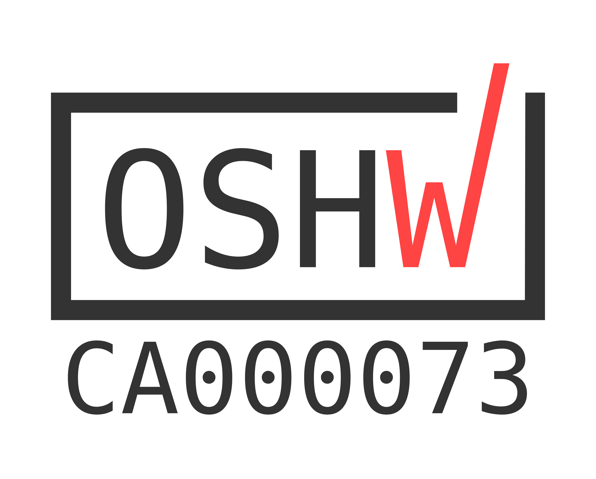

<!--- Open Source Assistive Technology: GitHub Readme Template Version 1.2 (2024-May-27)  --->

<!--- TEMPLATE INTRODUCTION --->

<!--- INSTRUCTIONS --->
<!--- This is a markdown template for creating the README.md file in a GitHub repository. This file is rendered and displayed automatically when someone visits the repository.

This document includes helper text that will not be displayed when rendered. Any text between the less-than sign + exclamation mark + three hyphen-minus (<!---) and matching three hyphen-minus + greater-than sign will not be displayed. This helper text can be deleted once the corresponding section is completed.

This template has a number of fields that can be searched and replaced with other text:
 - <Repository_Link> Replace this with the web address for the repository. e.g., (e.g., https://github.com/makersmakingchange/Open-Wobble-Switch))
 - <MMCWebLink> This is the website address including an alphanumeric id for the Makers Making Change Website. e.g., 01tJR000000698oYAA. This will come from MMC staff. 
Any text that is currently holding a space / is an instruction for the person filling in the README is in all capitals, to make it easier to see them in a rendered version.

--->
 
<!--- TITLE --->
# Shrub Hub
<!--- Should match the name of the GitHub repository. Choose something descriptive rather than whimsical.  --->

## Overview
<!--- A brief summary of the project. What it does, who it is for, how much it costs. --->
The Shrub Hub is an digital switch interface that allows a user to connect up to three 3.5mm assistive switches to a digital device like a computer or mobile phone. It has five modes, and can send keystrokes, mouse clicks, and media control commands, with five outputs per mode. It is designed to provide digital access to users using assistive switches, and to be low cost and very easy to build.

It is designed for use by those who have difficulty using traditional input devices like a computer mouse and may be especially useful for those with limited finger or hand dexterity.

The device is comprised of off-the-shelf electronics and 3D printed parts. There is no soldering or complicated assembly involved in building the device.

The Shrub Hub is open assistive technology (OpenAT). Under the terms of the open source licenses, the device may be built, used, and improved upon by anyone.

The overall cost of materials is about $35 (plus $8 for component shipping).

## Makers Making Change Assistive Device Library
<MMCWebLink>

## How to Obtain the Device
### 1. Do-it-Yourself (DIY) or Do-it-Together (DIT)

This is an open-source assistive technology, so anyone is free to build it. All of the files and instructions required to build the device are contained within this repository. Refer to the Maker Guide below.

### 2. Request a build of this device

> [!NOTE]
This device will be available for request as a volunteer maker build after final user validation is complete.

You may also submit a build request through the [Makers Making Change Assistive Device Library Listing](<MMCWebLink>) to have a volunteer maker build the device. As the requestor, you are responsible for reimbursing the maker for the cost of materials and any shipping.

### 3. Build this device for someone else

If you have the skills and equipment to build this device, and would like to donate your time to create the device for someone who needs it, visit the [MMC Maker Wanted](https://makersmakingchange.com/maker-wanted/) section.

## Build Instructions
<!--- Outline the major steps required to create a build --->

### 1. Read through the Maker Guide

The [Maker Guide](/Documentation/Shrub_Hub_Maker_Guide.pdf)  contains all the necessary information to build this device, including tool lists, assembly instructions, programming instructions and testing.

### 2. Order the Off-The-Shelf Components

The [Bill of Materials](/Documentation/Shrub_Hub_BOM.xlsx) lists all of the parts and components required to build the device.

### 3. Print the 3D Printable components

All of the files and individual print files can be found in the [/Build_Files/3D_Printing_Files](/Build_Files/3D_Printing_Files/) folder.

### 4. Assemble the Shrub Hub

Reference the Assembly Guide section of the [Maker Guide](/Documentation/Shrub_Hub_Maker_Guide.pdf) for the tools and steps required to build the device.

## How to improve this Device
As open source assistive technology, you are welcomed and encouraged to improve upon the design. 

## Files
### Documentation
<!--- Update the name, link, and version for documentation --->
| Document              | Version | Link |
|-----------------------|---------|------|
| Design Rationale      | 1.0     | [Shrub_Hub_Design_Rationale](/Documentation/Shrub_Hub_Design_Rationale.pdf)     |
| Maker Guide           | 1.0     | [Shrub_Hub_Maker_Guide](/Documentation/Shrub_Hub_Maker_Guide.pdf)     |
| Bill of Materials     | 1.0     | [Shrub_Hub_Bill_of_Materials](/Documentation/Working_Documents/Shrub_Hub_BOM.xlsx)     |
| User Guide            | 1.0     | [Shrub_Hub_User_Guide](/Documentation/Shrub_Hub_User_Guide.pdf)    |
| Quickstart Guide      | 1.0     | [Shrub_Hub_Quickstart_Guide](/Documentation/Shrub_Hub_Quickstart_Guide.pdf)    |
| Changing Outputs Guide| 1.0     | [Shrub_Hub_Changing_Outputs_Guide](/Documentation/Shrub_Hub_Changing_Outputs_Guide.pdf)    |
| Changelog             | 1.0     | [Changelog](CHANGES.txt)     |

### Design Files
<!--- Include a copy of the original design files to facilitate easy editing and customization. Consider also including a generic format (e.g., STEP) --->
 - [CAD Files](/Design_Files/CAD_Design_Files)

### Build Files
<!--- Include a copy of the build files intended for manufacturing. This may include svg files for laser cutting, stl files for 3d printing, Gerber files for custom PCBs, and Arduino files for custom firmware. --->
 - [3D Printing Files](/Build_Files/3D_Printing_Files)
 - [Firmware Files](/Build/Firmware_Files)

## License
<!--- Add the year(s) for the copyright and the Designer Name. You may use the standard set of open licenses or choose your own for the hardware, software, and accompanying materials. --->
Copyright (c) 2026 Neil Squire Society.

This repository describes Open Hardware:
 - Everything needed or used to design, make, test, or prepare the Shrub Hub is licensed under the [CERN 2.0 Weakly Reciprocal license (CERN-OHL-W v2) or later](https://cern.ch/cern-ohl ) .
 - All software is under the [GNU General Public License v3.0 (GPL-3.0)](https://www.gnu.org/licenses/gpl.html).
 - Accompanying material such as instruction manuals, videos, and other copyrightable works that are useful but not necessary to design, make, test, or prepare the Shrub Hub are published under a [Creative Commons Attribution-ShareAlike 4.0 license (CC BY-SA 4.0)](https://creativecommons.org/licenses/by-sa/4.0/) .

You may redistribute and modify this documentation and make products using it under the terms of the [CERN-OHL-W v2](https://cern.ch/cern-ohl).
This documentation is distributed WITHOUT ANY EXPRESS OR IMPLIED WARRANTY, INCLUDING OF MERCHANTABILITY, SATISFACTORY QUALITY AND FITNESS FOR A PARTICULAR PURPOSE.
Please see the CERN-OHL-W v2 for applicable conditions.

Source Location: https://github.com/makersmakingchange/Shrub-Hub 

## Attribution
The Shrub Hub enclosure, software, and documentation was designed and created by the Neil Squire Society. 

The Shrub Hub incorporates the [Adafruit TRRS Trinkey - USB Key for Assistive Technology](https://www.adafruit.com/product/5954), a commercially available open source hardware device available for purchase through Adafruit and its distributors worldwide. The design of the TRRS Trinkey was a collaboration between [ATMakers.org](https://atmakers.org/) and [Adafruit](https://www.adafruit.com/). The hardware design files are released under the CC-BY-SA 3.0 license and are available at https://github.com/adafruit/Adafruit-TRRS-Trinkey-PCB. This device is also certified open hardware by the Open Source Hardware Association (OSHWA), certification [US002639](https://certification.oshwa.org/us002639.html).

The Shrub Hub is programmed in [CircuitPython](https://circuitpython.org/) using the [Mu Python Editor](https://codewith.mu/).

<!--- This is the attribution for the template. --->
The documentation template was created by Makers Making Change / Neil Squire Society. It is available at the following link: [https://github.com/makersmakingchange/OpenAT-Template](https://github.com/makersmakingchange/OpenAT-Template)

### Contributors
<!--- List the names of the people that contributed to the design. This could include the original source of the idea, designers, testers, documenters, etc. --->
 - Brad Wellington. Shrub Hub Enclosure, firmware, documentation. Neil Squire Society / Makers Making Change.
 - Bill Binko. TRRS Trinkey PCB design and Learning Guide. [ATMakers.org](https://atmakers.org/).
 - Chris Young. TRRS Trinkey PCB Design. [ATMakers.org](https://atmakers.org/).
 - Eric Chau. Testing. Neil Squire Society / Solutions.
 - Jake McIvor. Documentation, testing. Neil Squire Society / Makers Making Change.
 - Limor Fried. TRRS Trinkey PCB Design. [Adafruit](https://www.adafruit.com/).
 - Liz Clark. TRRS Trinkey Learning Guide. [Adafruit](https://www.adafruit.com/).
 - Jody Dickerson. Testing. Neil Squire Society / Solutions.
 - Josie Versloot. Testing. Neil Squire Society / Makers Making Change.
 - Stephan Dobri. Testing. Neil Squire Society / Makers Making Change.
 
## Open Source Hardware Certification

The Shrub Hub has been certified as open source hardware by the Open Source Hardware Association under the OSHWA UID [CA000073](https://certification.oshwa.org/ca000073.html).

 

---

<!-- ABOUT MMC START -->
## About Makers Making Change

Makers Making Change is a program of [Neil Squire](https://www.neilsquire.ca/), a Canadian non-profit that uses technology, knowledge, and passion to empower people with disabilities.

Makers Making Change leverages the capacity of community based Makers, Disability Professionals and Volunteers to develop and deliver affordable Open Source Assistive Technologies.

 - Website: [www.MakersMakingChange.com](https://www.makersmakingchange.com/)
 - GitHub: [makersmakingchange](https://github.com/makersmakingchange)
 - Bluesky: [@makersmakingchange.bsky.social](https://bsky.app/profile/makersmakingchange.bsky.social)
 - Instagram: [@makersmakingchange](https://www.instagram.com/makersmakingchange)
 - Facebook: [makersmakechange](https://www.facebook.com/makersmakechange)
 - LinkedIn: [Neil Squire Society](https://www.linkedin.com/company/neil-squire-society/)
 - Thingiverse: [makersmakingchange](https://www.thingiverse.com/makersmakingchange/about)
 - Printables: [MakersMakingChange](https://www.printables.com/@MakersMakingChange)

### Contact Us
For technical questions, to get involved, or to share your experience we encourage you to [visit our website](https://www.makersmakingchange.com/) or [contact us](https://www.makersmakingchange.com/s/contact).
<!-- ABOUT MMC END -->
